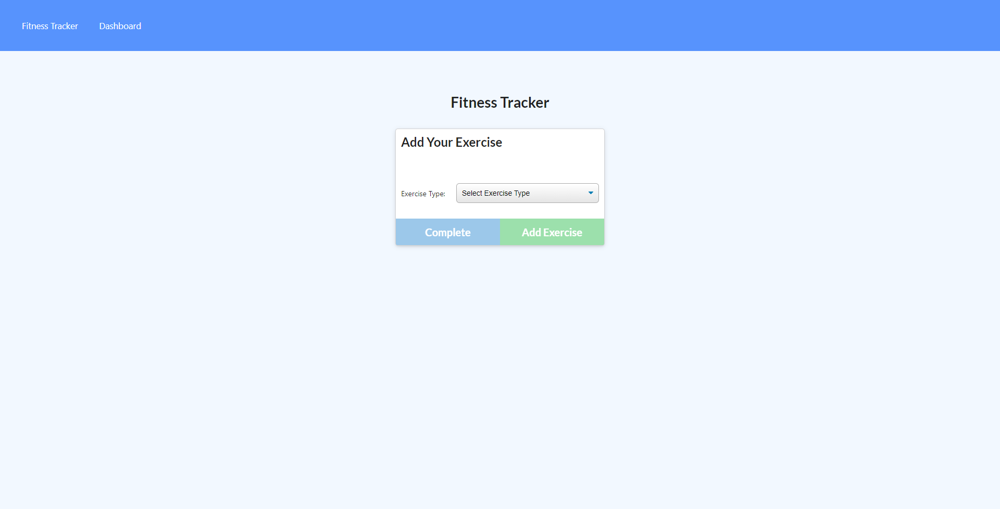
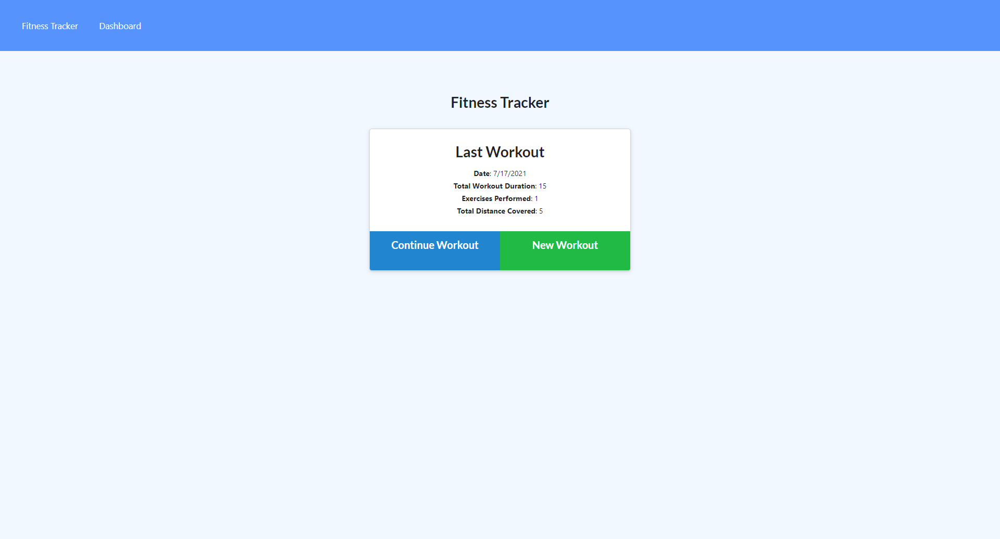
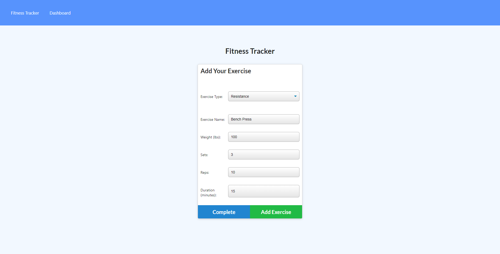
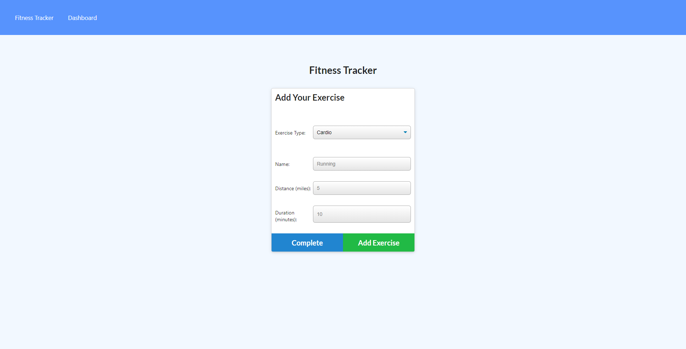
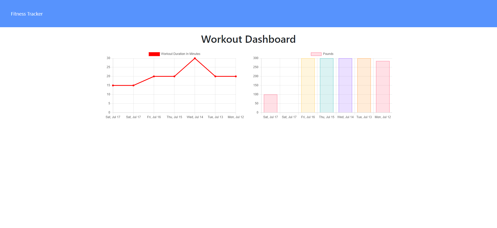

# Fitness tracker

The fitness-tracker app allows a users to track their physical activity for a week at a time. Happy lifting!

- Simply create a new workout, choose between cardio and resistance and then enter your information.
- You can continue your last workout by adding additional workouts.
- Once finished with a workout the app will calculate your total workout duration for the day.
- On the dashboard you can click on the link to be provided with a chart that breaks down your activity for you.

This app is deployed through Heroku using MongoAtlas

[Heroku](https://agile-harbor-94003.herokuapp.com/)

## Project Description

The Fitness Tracker is an app which allows the user to add exercises to a database, and also view a page which displays summary data on the last seven workouts.

- The app interacts with a database containing "Workout" objects, and each Workout contains an array of "Exercises."
- The home page of the app allows the user to choose either to begin a new Workout or continue with the most recent Workout in the database.
- In the beginning, it will take you to a page where you could add your new exercise workout.

 -new workout

 - home page workout

- Clicking on either of these buttons will direct the user to the exercise creation page.
- An exercise may be either "cardio" or "resistance," and the app prompts the user for different information depending on the choice.
- When all required information has been entered, the user may add a new exercise to the workout or finish and return to the home page.

 - add exercise , cardio

- By clicking on the "Dashboard" icon on the top of the page, the user is directed to the Stats page which displays graphs summarizing the last seven Workouts.

 -fitness dashboard

## Github link

https://github.com/Etipriya/workout-tracker

## Heroku link

https://agile-harbor-94003.herokuapp.com/
